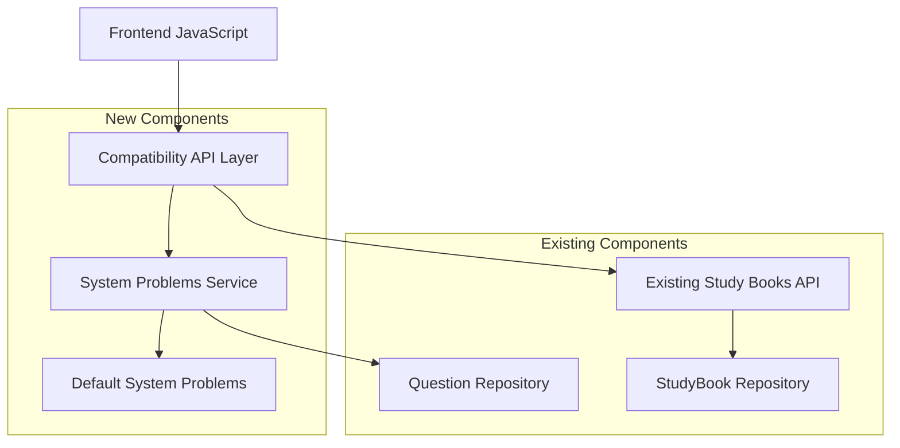

# Frontend API Compatibility Design

## 概要

既存フロントエンドとの互換性を確保するため、不足しているAPIエンドポイントを実装します。主な目標は、フロントエンドコードを変更せずに期待されるエンドポイント（`/api/v1/studybooks/languages`と`/api/v1/studybooks/system-problems/{language}`）を提供することです。

この設計は既存のinstant-search-backendアーキテクチャを拡張し、新しい互換性レイヤーを追加して、フロントエンドの期待に応えます。

## アーキテクチャ

### 高レベル設計



### 互換性戦略

1. **エンドポイント互換性**: 新しいルーターで`/api/v1/studybooks/`パスを提供
2. **データ互換性**: 既存のドメインモデルを再利用し、フロントエンド期待形式に変換
3. **機能拡張**: システム問題機能を新規実装

## Components and Interfaces

### 新しいAPIルーター

```python
# api/studybooks_compat.py
from fastapi import APIRouter, Depends
from typing import List
from uuid import UUID

router = APIRouter(prefix="/studybooks", tags=["studybooks-compatibility"])

@router.get("/languages", response_model=List[str])
async def get_languages_compat():
    """Frontend compatibility endpoint for languages."""
    pass

@router.get("/system-problems/{language}", response_model=List[SystemProblemResponse])
async def get_system_problems(language: str):
    """Get system problems for specified language."""
    pass
```

### システム問題サービス

```python
# app/system_problems_service.py
from typing import List, Optional
from abc import ABC, abstractmethod

class SystemProblemsService(ABC):
    @abstractmethod
    async def get_problems_by_language(self, language: str) -> List[SystemProblem]
    
    @abstractmethod
    async def get_available_languages(self) -> List[str]

class DefaultSystemProblemsService(SystemProblemsService):
    """Default implementation with predefined system problems."""
    
    def __init__(self):
        self.problems_data = self._load_default_problems()
    
    async def get_problems_by_language(self, language: str) -> List[SystemProblem]:
        """Get problems for specific language."""
        normalized_lang = language.lower()
        return self.problems_data.get(normalized_lang, [])
    
    async def get_available_languages(self) -> List[str]:
        """Get list of available languages."""
        return list(self.problems_data.keys())
    
    def _load_default_problems(self) -> dict:
        """Load default system problems for each language."""
        return {
            "html": [
                SystemProblem(
                    question="<div class='container'>",
                    answer="<div class='container'>",
                    difficulty="beginner",
                    category="tags"
                ),
                # More HTML problems...
            ],
            "css": [
                SystemProblem(
                    question="body { margin: 0; padding: 0; }",
                    answer="body { margin: 0; padding: 0; }",
                    difficulty="beginner", 
                    category="selectors"
                ),
                # More CSS problems...
            ],
            "javascript": [
                SystemProblem(
                    question="function calculateSum(a, b) { return a + b; }",
                    answer="function calculateSum(a, b) { return a + b; }",
                    difficulty="beginner",
                    category="functions"
                ),
                # More JavaScript problems...
            ],
            "sql": [
                SystemProblem(
                    question="SELECT * FROM users WHERE age > 18;",
                    answer="SELECT * FROM users WHERE age > 18;",
                    difficulty="beginner",
                    category="queries"
                ),
                # More SQL problems...
            ],
            # Additional languages...
        }
```

### データモデル

```python
# domain/system_problems.py
from pydantic import BaseModel
from typing import Optional

class SystemProblem(BaseModel):
    """System problem domain model."""
    question: str
    answer: str
    difficulty: str
    category: str
    language: Optional[str] = None

class SystemProblemResponse(BaseModel):
    """API response model for system problems."""
    id: str  # Generated ID for frontend compatibility
    question: str
    answer: str
    difficulty: str
    category: str
    language: str
    
    @classmethod
    def from_domain(cls, problem: SystemProblem, language: str) -> "SystemProblemResponse":
        """Convert domain model to response model."""
        return cls(
            id=f"{language}_{hash(problem.question)}",  # Generate stable ID
            question=problem.question,
            answer=problem.answer,
            difficulty=problem.difficulty,
            category=problem.category,
            language=language
        )
```

## Data Models

### デフォルトシステム問題データ

各言語に対して以下のような構造でデフォルト問題を定義：

```python
DEFAULT_PROBLEMS = {
    "html": [
        {
            "question": "<!DOCTYPE html>",
            "answer": "<!DOCTYPE html>",
            "difficulty": "beginner",
            "category": "doctype"
        },
        {
            "question": "<html lang='ja'>",
            "answer": "<html lang='ja'>",
            "difficulty": "beginner", 
            "category": "attributes"
        },
        {
            "question": "<meta charset='UTF-8'>",
            "answer": "<meta charset='UTF-8'>",
            "difficulty": "beginner",
            "category": "meta"
        },
        # 各言語につき20-30問程度
    ],
    "css": [
        {
            "question": "* { box-sizing: border-box; }",
            "answer": "* { box-sizing: border-box; }",
            "difficulty": "intermediate",
            "category": "universal"
        },
        {
            "question": ".container { max-width: 1200px; margin: 0 auto; }",
            "answer": ".container { max-width: 1200px; margin: 0 auto; }",
            "difficulty": "beginner",
            "category": "layout"
        },
        # More CSS problems...
    ],
    "javascript": [
        {
            "question": "const arr = [1, 2, 3, 4, 5];",
            "answer": "const arr = [1, 2, 3, 4, 5];",
            "difficulty": "beginner",
            "category": "arrays"
        },
        {
            "question": "arr.map(x => x * 2)",
            "answer": "arr.map(x => x * 2)",
            "difficulty": "intermediate",
            "category": "methods"
        },
        # More JavaScript problems...
    ],
    "php": [
        {
            "question": "<?php echo 'Hello World'; ?>",
            "answer": "<?php echo 'Hello World'; ?>",
            "difficulty": "beginner",
            "category": "basics"
        },
        # More PHP problems...
    ],
    "java": [
        {
            "question": "public class Main { public static void main(String[] args) {",
            "answer": "public class Main { public static void main(String[] args) {",
            "difficulty": "beginner",
            "category": "class"
        },
        # More Java problems...
    ],
    "python3": [
        {
            "question": "def calculate_sum(a, b): return a + b",
            "answer": "def calculate_sum(a, b): return a + b",
            "difficulty": "beginner",
            "category": "functions"
        },
        # More Python problems...
    ],
    "sql": [
        {
            "question": "CREATE TABLE users (id INT PRIMARY KEY, name VARCHAR(100));",
            "answer": "CREATE TABLE users (id INT PRIMARY KEY, name VARCHAR(100));",
            "difficulty": "intermediate",
            "category": "ddl"
        },
        # More SQL problems...
    ],
    "linux (red hat)": [
        {
            "question": "sudo yum install nginx",
            "answer": "sudo yum install nginx",
            "difficulty": "beginner",
            "category": "package"
        },
        # More Linux problems...
    ],
    "linux(debian)": [
        {
            "question": "sudo apt-get update && sudo apt-get install nginx",
            "answer": "sudo apt-get update && sudo apt-get install nginx", 
            "difficulty": "beginner",
            "category": "package"
        },
        # More Debian problems...
    ],
    "git": [
        {
            "question": "git add . && git commit -m 'Initial commit'",
            "answer": "git add . && git commit -m 'Initial commit'",
            "difficulty": "beginner",
            "category": "basics"
        },
        # More Git problems...
    ]
}
```

## Error Handling

### 互換性エラーレスポンス

```python
class CompatibilityErrorHandler:
    """Handle errors in a way that's compatible with frontend expectations."""
    
    @staticmethod
    def handle_language_not_found(language: str) -> List[SystemProblemResponse]:
        """Return empty list instead of 404 for missing languages."""
        return []
    
    @staticmethod
    def handle_service_error(error: Exception) -> JSONResponse:
        """Handle service errors with frontend-compatible format."""
        return JSONResponse(
            status_code=500,
            content={
                "error": "ServiceError",
                "message": "Unable to retrieve system problems",
                "trace_id": get_trace_id(),
                "timestamp": datetime.utcnow().isoformat() + 'Z'
            }
        )
```

### ログ戦略

```python
# 互換性エンドポイントの使用状況をログ
logger.info(
    "Compatibility endpoint accessed",
    extra={
        "endpoint": "/studybooks/languages",
        "user_id": user_id,
        "trace_id": trace_id,
        "compatibility_layer": True
    }
)
```

## Testing Strategy

### テスト構造

```
tests/
├── unit/
│   ├── app/
│   │   └── test_system_problems_service.py
│   └── domain/
│       └── test_system_problems.py
├── integration/
│   └── api/
│       └── test_studybooks_compat.py
└── compatibility/
    └── test_frontend_integration.py
```

### 互換性テスト

```python
# tests/compatibility/test_frontend_integration.py
class TestFrontendCompatibility:
    """Test frontend compatibility requirements."""
    
    async def test_languages_endpoint_format(self):
        """Test that languages endpoint returns expected format."""
        response = await client.get("/api/v1/studybooks/languages")
        assert response.status_code == 200
        data = response.json()
        assert isinstance(data, list)
        assert all(isinstance(lang, str) for lang in data)
        assert "HTML" in data
        assert "JavaScript" in data
    
    async def test_system_problems_endpoint_format(self):
        """Test that system problems endpoint returns expected format."""
        response = await client.get("/api/v1/studybooks/system-problems/JavaScript")
        assert response.status_code == 200
        data = response.json()
        assert isinstance(data, list)
        
        if data:  # If problems exist
            problem = data[0]
            assert "id" in problem
            assert "question" in problem
            assert "answer" in problem
            assert "difficulty" in problem
            assert "category" in problem
            assert "language" in problem
    
    async def test_case_insensitive_language_matching(self):
        """Test that language matching is case insensitive."""
        responses = await asyncio.gather(
            client.get("/api/v1/studybooks/system-problems/javascript"),
            client.get("/api/v1/studybooks/system-problems/JavaScript"),
            client.get("/api/v1/studybooks/system-problems/JAVASCRIPT")
        )
        
        for response in responses:
            assert response.status_code == 200
            # All should return the same data
            assert responses[0].json() == response.json()
```

## Performance Considerations

### キャッシュ戦略

```python
from functools import lru_cache
from typing import Dict, List

class CachedSystemProblemsService(SystemProblemsService):
    """Cached implementation for better performance."""
    
    def __init__(self):
        self._problems_cache: Optional[Dict[str, List[SystemProblem]]] = None
        self._languages_cache: Optional[List[str]] = None
    
    @lru_cache(maxsize=128)
    async def get_problems_by_language(self, language: str) -> List[SystemProblem]:
        """Cached problem retrieval."""
        if self._problems_cache is None:
            self._problems_cache = self._load_default_problems()
        
        normalized_lang = language.lower()
        return self._problems_cache.get(normalized_lang, [])
    
    @lru_cache(maxsize=1)
    async def get_available_languages(self) -> List[str]:
        """Cached language list."""
        if self._languages_cache is None:
            if self._problems_cache is None:
                self._problems_cache = self._load_default_problems()
            self._languages_cache = list(self._problems_cache.keys())
        
        return self._languages_cache
```

### レスポンス最適化

- 言語リスト: 静的データなので初回ロード後はメモリキャッシュ
- システム問題: 言語ごとにキャッシュし、必要時のみロード
- レスポンス圧縮: FastAPIの自動圧縮を活用

## Integration with Existing System

### 既存システムとの統合

1. **ルーター統合**: 新しい互換性ルーターを既存のFastAPIアプリに追加
2. **依存性注入**: 既存のDIパターンに従ってサービスを注入
3. **ログ統合**: 既存の構造化ログシステムを使用
4. **エラーハンドリング**: 既存のグローバル例外ハンドラーと連携

### 設定管理

```python
# app/config.py に追加
class Settings(BaseSettings):
    # 既存設定...
    
    # 互換性機能の設定
    enable_compatibility_endpoints: bool = True
    system_problems_cache_size: int = 128
    default_problems_per_language: int = 25
```

### マイグレーション戦略

1. **段階的展開**: 互換性エンドポイントを段階的に有効化
2. **フォールバック**: 既存エンドポイントへのフォールバック機能
3. **監視**: 互換性エンドポイントの使用状況を監視
4. **廃止計画**: 将来的な統合と廃止のロードマップ