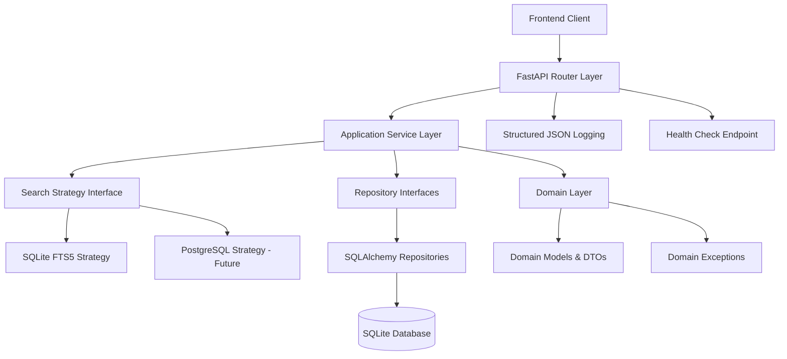

# 設計書

## 概要

インスタント検索バックエンドは、既存フロントエンド仕様を変更せずに接続可能なFastAPIベースのシステムで、フロントエンドテスト用の一時的なソリューションとして設計され、Java/Spring Boot + PostgreSQLへの明確な移行パスを維持します。このシステムは、学習帳、問題、学習分析、全文検索機能を持つタイピング練習アプリケーションを実装します。

アーキテクチャは厳密な層分離を持つドメイン駆動設計の原則に従い、開発時はSQLiteとFTS5を使用し、包括的な構造化ログと監視機能を含みます。

## コード品質とシンプルさの設計原則

### シンプルさ優先の設計方針

1. **最小限の実装**: 機能要件を満たす最小限のコードで実装し、過度な抽象化を避ける
2. **ファイル数の最小化**: 必要最小限のファイル構成で機能を実現し、不要なファイルは作成しない
3. **可読性重視**: コードの可読性を最優先とし、複雑なロジックは分割して理解しやすくする
4. **継続的リファクタリング**: 各実装工程完了時に一貫したルールでコードを整理・改善する

### 実装ガイドライン

- **単一責任の原則**: 各クラス・関数は単一の責任を持つ
- **依存関係の最小化**: 外部ライブラリは必要最小限に留める
- **命名規則の統一**: 意図が明確に伝わる命名を使用する
- **重複コードの排除**: DRY原則に従い、重複を避ける
- **エラーハンドリングの統一**: 一貫したエラー処理パターンを使用する

## アーキテクチャ

### 高レベルアーキテクチャ



### 層の責務

**API層 (`api/`)**
- FastAPIルーターとエンドポイント定義
- Pydanticモデルを使用したリクエスト/レスポンス検証
- HTTPステータスコード管理
- OpenAPIドキュメント生成
- 認証ミドルウェア（OIDC対応のモック）

**アプリケーション層 (`app/`)**
- ビジネスロジックとユースケース
- サービスオーケストレーション
- トランザクション管理
- ユーザーコンテキストと認可
- ドメインとインフラストラクチャ間の統合

**ドメイン層 (`domain/`)**
- コアビジネスエンティティと値オブジェクト
- リポジトリインターフェース（データベース非依存）
- ドメイン例外とエラータイプ
- ビジネスルールと検証ロジック
- データ転送用DTO

**インフラストラクチャ層 (`infra/`)**
- データベース実装（SQLAlchemy）
- 検索戦略実装
- 外部サービス統合
- 設定管理
- ログインフラストラクチャ

## Components and Interfaces

### Core Domain Models

```python
# User aggregate
class User:
    id: UUID
    name: str
    email: str  # unique
    created_at: datetime
    updated_at: datetime

# StudyBook aggregate
class StudyBook:
    id: UUID
    user_id: UUID
    title: str
    description: str
    created_at: datetime
    updated_at: datetime

# Question entity
class Question:
    id: UUID
    study_book_id: UUID
    language: str
    category: str
    difficulty: str
    question: str
    answer: str
    created_at: datetime
    updated_at: datetime

# TypingLog entity
class TypingLog:
    id: UUID
    user_id: UUID
    question_id: Optional[UUID]
    wpm: int
    accuracy: float
    took_ms: int
    created_at: datetime

# LearningEvent entity
class LearningEvent:
    id: UUID
    user_id: str
    app_id: str
    action: str
    object_id: Optional[str]
    score: Optional[float]
    duration_ms: Optional[int]
    occurred_at: datetime
```

### Repository Interfaces

```python
class UserRepository(ABC):
    @abstractmethod
    async def create(self, user: User) -> User
    @abstractmethod
    async def get_by_id(self, user_id: UUID) -> Optional[User]
    @abstractmethod
    async def get_by_email(self, email: str) -> Optional[User]

class StudyBookRepository(ABC):
    @abstractmethod
    async def create(self, study_book: StudyBook) -> StudyBook
    @abstractmethod
    async def get_by_user_id(self, user_id: UUID) -> List[StudyBook]
    @abstractmethod
    async def get_by_id(self, study_book_id: UUID, user_id: UUID) -> Optional[StudyBook]
    @abstractmethod
    async def update(self, study_book: StudyBook) -> StudyBook
    @abstractmethod
    async def delete(self, study_book_id: UUID, user_id: UUID) -> bool

class QuestionRepository(ABC):
    @abstractmethod
    async def create(self, question: Question) -> Question
    @abstractmethod
    async def get_random_by_study_book(self, study_book_id: UUID, user_id: UUID) -> Optional[Question]
    @abstractmethod
    async def get_by_study_book(self, study_book_id: UUID, user_id: UUID) -> List[Question]
```

### Search Strategy Interface

```python
class SearchStrategy(ABC):
    @abstractmethod
    async def search_questions(self, query: str, user_id: UUID, limit: int = 50) -> List[SearchResult]
    @abstractmethod
    async def rebuild_index(self) -> None

class SearchResult:
    question_id: UUID
    question: str
    answer: str
    highlight: str
    score: float
```

### Authentication Interface

```python
class AuthenticationService(ABC):
    @abstractmethod
    async def get_current_user_id(self, request: Request) -> UUID
    @abstractmethod
    async def create_user(self, name: str, email: str) -> UUID

# Mock implementation for development
class MockAuthenticationService(AuthenticationService):
    # Uses X-User-Id header or creates mock users
    # Future: Replace with OIDC implementation
```

## Data Models

### Database Schema

**Users Table**
```sql
CREATE TABLE users (
    id TEXT PRIMARY KEY,  -- UUID as TEXT
    name TEXT NOT NULL,
    email TEXT UNIQUE NOT NULL,
    created_at TEXT NOT NULL,  -- ISO8601 UTC
    updated_at TEXT NOT NULL
);
```

**Study Books Table**
```sql
CREATE TABLE study_books (
    id TEXT PRIMARY KEY,
    user_id TEXT NOT NULL,
    title TEXT NOT NULL,
    description TEXT,
    created_at TEXT NOT NULL,
    updated_at TEXT NOT NULL,
    FOREIGN KEY (user_id) REFERENCES users(id) ON DELETE CASCADE
);

CREATE INDEX idx_study_books_user_id ON study_books(user_id);
```

**Questions Table**
```sql
CREATE TABLE questions (
    id TEXT PRIMARY KEY,
    study_book_id TEXT NOT NULL,
    language TEXT NOT NULL,
    category TEXT NOT NULL,
    difficulty TEXT NOT NULL,
    question TEXT NOT NULL,
    answer TEXT NOT NULL,
    created_at TEXT NOT NULL,
    updated_at TEXT NOT NULL,
    FOREIGN KEY (study_book_id) REFERENCES study_books(id) ON DELETE CASCADE
);

CREATE INDEX idx_questions_study_book_id ON questions(study_book_id);
```

**FTS5 Virtual Table for Search**
```sql
CREATE VIRTUAL TABLE questions_fts USING fts5(
    question_id UNINDEXED,
    question,
    answer,
    content='questions',
    content_rowid='rowid'
);

-- Triggers to maintain FTS5 sync
CREATE TRIGGER questions_fts_insert AFTER INSERT ON questions BEGIN
    INSERT INTO questions_fts(question_id, question, answer) 
    VALUES (new.id, new.question, new.answer);
END;

CREATE TRIGGER questions_fts_update AFTER UPDATE ON questions BEGIN
    UPDATE questions_fts SET question = new.question, answer = new.answer 
    WHERE question_id = new.id;
END;

CREATE TRIGGER questions_fts_delete AFTER DELETE ON questions BEGIN
    DELETE FROM questions_fts WHERE question_id = old.id;
END;
```

**Typing Logs Table**
```sql
CREATE TABLE typing_logs (
    id TEXT PRIMARY KEY,
    user_id TEXT NOT NULL,
    question_id TEXT,
    wpm INTEGER NOT NULL,
    accuracy REAL NOT NULL,
    took_ms INTEGER NOT NULL,
    created_at TEXT NOT NULL,
    FOREIGN KEY (user_id) REFERENCES users(id) ON DELETE CASCADE,
    FOREIGN KEY (question_id) REFERENCES questions(id) ON DELETE SET NULL
);

CREATE INDEX idx_typing_logs_user_id ON typing_logs(user_id);
CREATE INDEX idx_typing_logs_question_id ON typing_logs(question_id);
```

**Learning Events Table**
```sql
CREATE TABLE learning_events (
    id TEXT PRIMARY KEY,
    user_id TEXT NOT NULL,
    app_id TEXT NOT NULL,
    action TEXT NOT NULL,
    object_id TEXT,
    score REAL,
    duration_ms INTEGER,
    occurred_at TEXT NOT NULL,
    FOREIGN KEY (user_id) REFERENCES users(id) ON DELETE CASCADE
);

CREATE INDEX idx_learning_events_user_occurred ON learning_events(user_id, occurred_at DESC);
```

### SQLite Configuration

```python
# Database initialization with required PRAGMA settings
async def init_database():
    # Enable foreign keys
    await database.execute("PRAGMA foreign_keys=ON")
    # Enable WAL mode for better concurrency
    await database.execute("PRAGMA journal_mode=WAL")
    # Set synchronous mode for performance
    await database.execute("PRAGMA synchronous=NORMAL")
```

## Error Handling

### Domain Exceptions

```python
class DomainException(Exception):
    """Base domain exception"""
    pass

class UserNotFoundError(DomainException):
    pass

class StudyBookNotFoundError(DomainException):
    pass

class UnauthorizedAccessError(DomainException):
    pass

class ValidationError(DomainException):
    pass

class SearchIndexError(DomainException):
    pass
```

### API Error Responses

```python
class ErrorResponse(BaseModel):
    error: str
    message: str
    trace_id: str
    timestamp: datetime

# HTTP status code mapping
ERROR_STATUS_MAP = {
    UserNotFoundError: 404,
    StudyBookNotFoundError: 404,
    UnauthorizedAccessError: 403,
    ValidationError: 400,
    SearchIndexError: 500,
}
```

### Global Exception Handler

```python
@app.exception_handler(DomainException)
async def domain_exception_handler(request: Request, exc: DomainException):
    trace_id = get_trace_id(request)
    status_code = ERROR_STATUS_MAP.get(type(exc), 500)
    
    logger.error(
        "Domain exception occurred",
        extra={
            "trace_id": trace_id,
            "exception_type": type(exc).__name__,
            "message": str(exc),
            "status_code": status_code
        }
    )
    
    return JSONResponse(
        status_code=status_code,
        content=ErrorResponse(
            error=type(exc).__name__,
            message=str(exc),
            trace_id=trace_id,
            timestamp=datetime.utcnow()
        ).dict()
    )
```

## Testing Strategy

### Test Structure

```
tests/
├── unit/
│   ├── domain/          # Domain model tests
│   ├── app/             # Service layer tests
│   └── infra/           # Repository implementation tests
├── integration/
│   ├── api/             # API endpoint tests
│   ├── database/        # Database integration tests
│   └── search/          # Search functionality tests
├── contract/
│   ├── repository/      # Repository contract tests
│   └── search/          # Search strategy contract tests
└── fixtures/
    └── test_data.py     # Test data factories
```

### Testing Approach

**Unit Tests**
- Domain model validation and business rules
- Service layer logic without external dependencies
- Repository interface contracts using mocks

**Integration Tests**
- API endpoints with test database
- Database operations with SQLite in-memory
- Search functionality with FTS5

**Contract Tests**
- Repository implementations against interface contracts
- Search strategy implementations against interface contracts
- Ensures future PostgreSQL implementations will work

**Test Database Strategy**
```python
# Use in-memory SQLite for fast tests
TEST_DATABASE_URL = "sqlite:///:memory:"

# Test fixtures for consistent data
@pytest.fixture
async def test_db():
    database = Database(TEST_DATABASE_URL)
    await database.connect()
    await run_migrations(database)
    yield database
    await database.disconnect()

@pytest.fixture
async def sample_user():
    return User(
        id=uuid4(),
        name="Test User",
        email="test@example.com",
        created_at=datetime.utcnow(),
        updated_at=datetime.utcnow()
    )
```

### Migration to Testcontainers

```python
# Future PostgreSQL testing with Testcontainers
@pytest.fixture(scope="session")
async def postgres_container():
    with PostgreSQLContainer("postgres:15") as postgres:
        database_url = postgres.get_connection_url()
        # Run migrations against real PostgreSQL
        yield database_url
```

## Logging and Monitoring

### Structured Logging Format

```python
class LogEntry(BaseModel):
    timestamp: datetime
    level: str
    message: str
    trace_id: str
    user_id: Optional[str]
    app_id: str = "instant-search-backend"
    version: str
    module: str
    extra: Dict[str, Any] = {}

# Logger configuration
logging.config.dictConfig({
    "version": 1,
    "formatters": {
        "json": {
            "class": "pythonjsonlogger.jsonlogger.JsonFormatter",
            "format": "%(timestamp)s %(level)s %(message)s %(trace_id)s %(user_id)s %(app_id)s %(version)s %(module)s"
        }
    },
    "handlers": {
        "console": {
            "class": "logging.StreamHandler",
            "formatter": "json"
        }
    },
    "root": {
        "level": "INFO",
        "handlers": ["console"]
    }
})
```

### Health Check Implementation

```python
@router.get("/healthz", response_model=HealthResponse)
async def health_check():
    health_status = {
        "status": "healthy",
        "version": settings.APP_VERSION,
        "timestamp": datetime.utcnow(),
        "checks": {}
    }
    
    # Database connectivity check
    try:
        await database.execute("SELECT 1")
        health_status["checks"]["database"] = {"status": "ok"}
    except Exception as e:
        health_status["status"] = "unhealthy"
        health_status["checks"]["database"] = {
            "status": "error",
            "message": str(e)
        }
    
    # Search index check
    try:
        await search_strategy.search_questions("test", UUID("00000000-0000-0000-0000-000000000000"), limit=1)
        health_status["checks"]["search"] = {"status": "ok"}
    except Exception as e:
        health_status["status"] = "degraded"
        health_status["checks"]["search"] = {
            "status": "error",
            "message": str(e)
        }
    
    status_code = 200 if health_status["status"] == "healthy" else 503
    return JSONResponse(content=health_status, status_code=status_code)
```

### Request Tracing

```python
@app.middleware("http")
async def add_trace_id(request: Request, call_next):
    trace_id = str(uuid4())
    request.state.trace_id = trace_id
    
    # Add to response headers
    response = await call_next(request)
    response.headers["X-Trace-ID"] = trace_id
    
    return response

def get_trace_id(request: Request) -> str:
    return getattr(request.state, "trace_id", "unknown")
```

## Migration Strategy

### Database Migration Path

**Current: SQLite → Future: PostgreSQL**

1. **Schema Compatibility**
   - Use TEXT for UUIDs (compatible with PostgreSQL UUID type)
   - ISO8601 timestamps (compatible with PostgreSQL TIMESTAMPTZ)
   - Standard SQL DDL that works on both databases

2. **Search Migration**
   - SQLite FTS5 → PostgreSQL tsvector + pg_trgm
   - Same SearchStrategy interface
   - Drop-in replacement of implementation

3. **Data Migration Script**
   ```python
   async def migrate_sqlite_to_postgres():
       # Export from SQLite
       sqlite_data = await export_all_tables(sqlite_db)
       
       # Transform data if needed
       postgres_data = transform_for_postgres(sqlite_data)
       
       # Import to PostgreSQL
       await import_all_tables(postgres_db, postgres_data)
   ```

### Code Migration Path

**Current: FastAPI/Python → Future: Spring Boot/Java**

1. **API Compatibility**
   - Same endpoint paths and HTTP methods
   - Same request/response JSON structures
   - Same error response formats

2. **Domain Model Translation**
   ```python
   # Python Pydantic model
   class StudyBook(BaseModel):
       id: UUID
       user_id: UUID
       title: str
       description: Optional[str]
   ```
   
   ```java
   // Java Spring Boot entity
   @Entity
   @Table(name = "study_books")
   public class StudyBook {
       @Id
       private UUID id;
       
       @Column(name = "user_id")
       private UUID userId;
       
       private String title;
       private String description;
   }
   ```

3. **Repository Pattern Translation**
   - Python ABC → Java Interface
   - SQLAlchemy → Spring Data JPA
   - Same method signatures and behavior

### Configuration Migration

```yaml
# Current: Python environment variables
DATABASE_URL: sqlite:///./app.db
APP_VERSION: 1.0.0
LOG_LEVEL: INFO

# Future: Spring Boot application.yml
spring:
  datasource:
    url: jdbc:postgresql://localhost:5432/app
    username: ${DB_USERNAME}
    password: ${DB_PASSWORD}
  jpa:
    hibernate:
      ddl-auto: validate
  flyway:
    enabled: true
    locations: classpath:db/migration

app:
  version: 1.0.0
logging:
  level:
    com.example.app: INFO
```