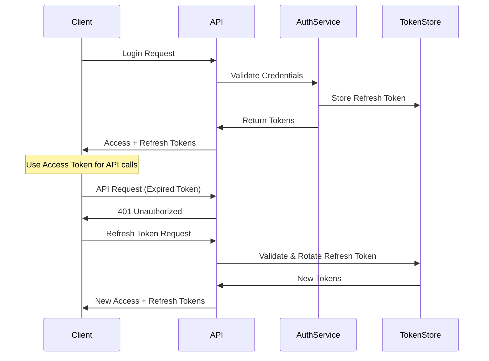

# ADR-002: JWT Authentication Strategy

## Status
Accepted

## Date
2024-01-20

## Context

The RemindCodeTyping application initially used a simple session-based authentication with user IDs passed in headers. As the application evolved, several limitations became apparent:

1. **Scalability Issues**: Session storage doesn't scale well in distributed environments
2. **Security Concerns**: Simple user ID headers are easily spoofed
3. **Stateful Nature**: Server-side session storage creates state management complexity
4. **Mobile/SPA Limitations**: Session cookies don't work well with mobile apps and SPAs
5. **Microservices Challenges**: Session sharing between services is complex

The team needed to implement a more robust, scalable, and secure authentication mechanism.

## Decision

We will implement JWT (JSON Web Token) based authentication with the following characteristics:

### Token Strategy

1. **Access Tokens**: Short-lived (1 hour) JWT tokens for API access
2. **Refresh Tokens**: Long-lived (30 days) tokens for obtaining new access tokens
3. **Token Rotation**: Refresh tokens are rotated on each use for enhanced security
4. **Stateless Authentication**: No server-side session storage required

### Token Structure

```json
{
  "header": {
    "alg": "HS512",
    "typ": "JWT"
  },
  "payload": {
    "sub": "user-uuid",
    "loginId": "john_doe",
    "role": "USER",
    "iat": 1640995200,
    "exp": 1640998800,
    "jti": "token-uuid"
  }
}
```

### Security Features

1. **HMAC-SHA512 Signing**: Tokens signed with strong cryptographic algorithm
2. **Short Expiration**: Access tokens expire quickly to limit exposure
3. **Refresh Token Rotation**: Refresh tokens are single-use and rotated
4. **Secure Storage**: Refresh tokens stored securely in database
5. **Revocation Support**: Ability to revoke all tokens for a user

## Implementation Details

### Backend Implementation

```java
@Service
public class JwtTokenService {
    
    public String generateAccessToken(User user) {
        return Jwts.builder()
            .setSubject(user.getId().getValue().toString())
            .setIssuedAt(new Date())
            .setExpiration(new Date(System.currentTimeMillis() + ACCESS_TOKEN_EXPIRATION))
            .claim("loginId", user.getLoginId().getValue())
            .claim("role", user.getRole().getCode())
            .signWith(SignatureAlgorithm.HS512, secretKey)
            .compact();
    }
    
    public String generateRefreshToken(User user) {
        return Jwts.builder()
            .setSubject(user.getId().getValue().toString())
            .setIssuedAt(new Date())
            .setExpiration(new Date(System.currentTimeMillis() + REFRESH_TOKEN_EXPIRATION))
            .setId(UUID.randomUUID().toString())
            .signWith(SignatureAlgorithm.HS512, secretKey)
            .compact();
    }
}
```

### Frontend Implementation

```javascript
class TokenManager {
    
    async refreshTokenIfNeeded() {
        const token = this.getAccessToken();
        if (!token || this.isTokenExpiringSoon(token)) {
            return await this.refreshAccessToken();
        }
        return token;
    }
    
    async refreshAccessToken() {
        const refreshToken = this.getRefreshToken();
        if (!refreshToken) {
            throw new Error('No refresh token available');
        }
        
        const response = await this.apiClient.post('/auth/refresh', {
            refreshToken: refreshToken
        });
        
        if (response.success) {
            this.storeTokens(response.accessToken, response.refreshToken);
            return response.accessToken;
        } else {
            this.clearTokens();
            throw new Error('Token refresh failed');
        }
    }
}
```

### Security Configuration

```java
@Configuration
@EnableWebSecurity
public class SecurityConfig {
    
    @Bean
    public SecurityFilterChain filterChain(HttpSecurity http) throws Exception {
        http
            .sessionManagement(session -> 
                session.sessionCreationPolicy(SessionCreationPolicy.STATELESS))
            .addFilterBefore(jwtAuthenticationFilter(), 
                UsernamePasswordAuthenticationFilter.class)
            .authorizeHttpRequests(auth -> auth
                .requestMatchers("/api/auth/login", "/api/auth/register", "/api/auth/demo")
                    .permitAll()
                .anyRequest().authenticated()
            );
        
        return http.build();
    }
}
```

## Consequences

### Positive

1. **Stateless Architecture**: No server-side session storage required
2. **Scalability**: Tokens can be validated without database lookups
3. **Cross-Domain Support**: Works well with CORS and multiple domains
4. **Mobile Friendly**: No dependency on cookies or sessions
5. **Microservices Ready**: Tokens can be validated by any service
6. **Security**: Strong cryptographic signing and short expiration times
7. **Flexibility**: Easy to add custom claims and permissions

### Negative

1. **Token Size**: JWTs are larger than simple session IDs
2. **Revocation Complexity**: Immediate token revocation requires additional infrastructure
3. **Secret Management**: Signing keys must be securely managed and rotated
4. **Client Complexity**: Frontend must handle token refresh logic
5. **Storage Security**: Tokens must be stored securely on client side

### Risk Mitigation

1. **Token Rotation**: Refresh tokens are rotated to limit exposure
2. **Short Expiration**: Access tokens expire quickly
3. **Secure Storage**: Use secure storage mechanisms on client
4. **Key Rotation**: Regular rotation of signing keys
5. **Monitoring**: Log and monitor authentication events

## Token Lifecycle



## Storage Strategy

### Backend Storage

```java
@Entity
public class RefreshToken {
    private String tokenId;
    private UUID userId;
    private String tokenHash;
    private LocalDateTime expiresAt;
    private boolean revoked;
    
    // Methods for token management
}
```

### Frontend Storage

```javascript
// Secure token storage strategy
class SecureTokenStorage {
    
    storeTokens(accessToken, refreshToken) {
        // Store access token in memory (most secure)
        this.accessToken = accessToken;
        
        // Store refresh token in httpOnly cookie or secure storage
        if (this.isSecureContext()) {
            document.cookie = `refreshToken=${refreshToken}; HttpOnly; Secure; SameSite=Strict`;
        } else {
            // Fallback to localStorage with encryption
            this.encryptAndStore('refreshToken', refreshToken);
        }
    }
}
```

## Migration Strategy

1. **Phase 1**: Implement JWT alongside existing authentication
2. **Phase 2**: Update frontend to use JWT tokens
3. **Phase 3**: Migrate existing users to JWT-based sessions
4. **Phase 4**: Remove legacy authentication system
5. **Phase 5**: Optimize and enhance JWT implementation

## Alternatives Considered

1. **Session-Based Authentication**: Rejected due to scalability limitations
2. **OAuth 2.0 with External Provider**: Rejected to maintain control over user data
3. **API Keys**: Rejected due to lack of user context and expiration
4. **Basic Authentication**: Rejected due to security concerns

## Security Considerations

### Token Security

1. **Signing Algorithm**: Use HMAC-SHA512 for strong security
2. **Secret Management**: Store signing secrets securely
3. **Token Validation**: Validate all token claims on each request
4. **Expiration Handling**: Implement proper token expiration logic

### Attack Mitigation

1. **XSS Protection**: Store tokens securely to prevent XSS attacks
2. **CSRF Protection**: Use proper CSRF tokens for state-changing operations
3. **Token Theft**: Implement token rotation and monitoring
4. **Replay Attacks**: Use short expiration times and unique token IDs

## Monitoring and Logging

```java
@Component
public class AuthenticationEventListener {
    
    @EventListener
    public void handleAuthenticationSuccess(AuthenticationSuccessEvent event) {
        log.info("Authentication successful for user: {}", event.getUserId());
        // Record metrics and audit logs
    }
    
    @EventListener
    public void handleTokenRefresh(TokenRefreshEvent event) {
        log.info("Token refreshed for user: {}", event.getUserId());
        // Monitor token refresh patterns
    }
}
```

## Performance Considerations

1. **Token Validation**: Cache public keys for signature verification
2. **Database Queries**: Optimize refresh token lookups with proper indexing
3. **Token Size**: Keep JWT payload minimal to reduce network overhead
4. **Caching**: Cache user permissions to avoid repeated database lookups

## References

- [RFC 7519: JSON Web Token (JWT)](https://tools.ietf.org/html/rfc7519)
- [JWT Best Practices](https://tools.ietf.org/html/draft-ietf-oauth-jwt-bcp-07)
- [OWASP JWT Security Cheat Sheet](https://cheatsheetseries.owasp.org/cheatsheets/JSON_Web_Token_for_Java_Cheat_Sheet.html)

## Review Date

This ADR should be reviewed in 6 months (July 2024) to assess the security posture and performance characteristics of the JWT implementation.